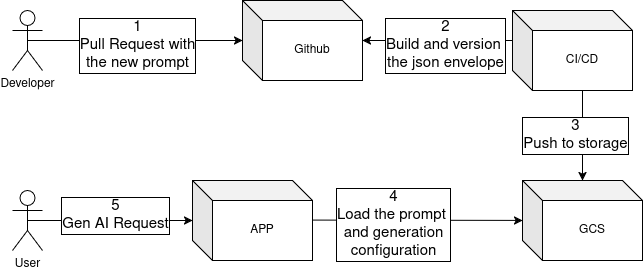

This repository contains an example of a "Prompt-as-Code" workflow. The goal is to manage prompts for Large Language Models (LLMs) in a structured, version-controlled way, similar to how software is developed.

The diagram below illustrates the process of how prompts are developed, versioned, and deployed to an application that uses them to interact with a generative AI.

Schema of the process

